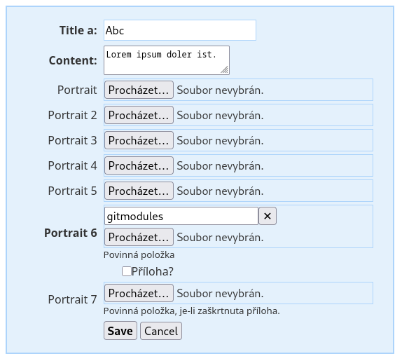
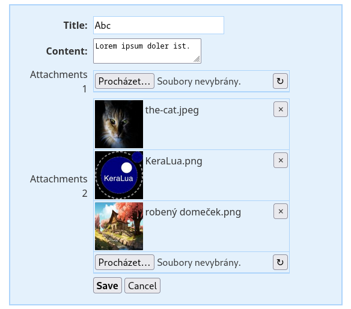

Nette form FileControl
======================

Nahrávání souborů je snadné. Pokud je ale soubor již nahraný v systému, je někdy potřeba

- jej pouze zobrazit (nejlépe s náhledem),
- nebo soubor smazat,
- nebo soubor nahradit jinou verzí.

Se standardním inputem typu file je několik potíží:

1. Je nepohodlné, že nejde rozumným způsobem zobrazit původní soubor — na rozdíl od ostatních inputů, kde lze původní hodnotu zobrazit.
2. S tím souvisí i to, jak existující soubor smazat.
3. Nepohodlné je, když vznikne nesouvisející chyba jinde ve formuláři. Formulář je tedy vrácen, ať si to uživatel opraví — jenže nahrávaný soubor (či soubory) je nutné navolit znovu.
4. Při nahrávání souboru formulářem je práce se soubory *jiná* než s ostatními položkami.
5. Kapitola sama o sobě je nahrávání velkých souborů.

**FileControl** se toto snaží řešit několika technikami:

1. Existující soubor je vyjádřen hodnotou třídy `FileCurrent`. Pokud jej uživatel smaže, je ve formuláři hodnota třídy `FileCurrent` s vlastností `remove` nastavenou na `True`.
2. Všechny nahrávané soubory se ukládají v transakci. Jednou nahraný soubor je uschován ve speciálním úložišti (v defaultu řešeném jako adresář v tempu, lze změnit) a po úspěšném uložení formuláře zanesen do systému.

Obrázkové soubory je možné reprezentovat jako obrázky. Pokud standardní renderer nevyhovuje, lze nastavit vlastní.

Hodnota inputu může nabývat tří možností:

- `Null`: žádný, nebo původní soubor smazán
- `FileUploaded`: nahraný nový soubor
- `FileCurrent`: původní soubor uložený v systému


## Instalace
```
composer require tacoberu/nette-form-fileupload
```


### Použití
Do `config.neon` je potřeba rozšíření zaregistrovat a nakonfigurovat:
```neon
extensions:
	filecontrol: Taco\Nette\Forms\Controls\FileControlExtension


filecontrol:
	store: Taco\Nette\Forms\Controls\UploadStoreTemp('uploading/txt-', baseDir: %tempDir%)

```

Ve formuláři pak lze použít:
```php
use Taco\Nette\Forms\Controls\FileCurrent;
use Taco\Nette\Forms\Controls\FileControl;
use Taco\Nette\Forms\Controls\GenericFilePreviewer;

$form = new Nette\Forms\Form;

$form->addFileControl('portrait', 'Portrait');
$form->addMultiFileControl('attachments1', 'Attachments 1');
```

Formulář s jedním souborem (`FileControl`) — u nahraného souboru je tlačítko pro smazání:



Formulář s více soubory (`MultiFileControl`) — s náhledy obrázků, mazáním jednotlivých položek (✕) a tlačítkem ↻ pro přednahrání bez odeslání celého formuláře:




## Co FileControl a MultiFileControl podporují

### Provoz bez JS

**Controly jsou plně funkční i bez JavaScriptu.** Tlačítko ↻ umožňuje uživateli nahrát soubory před odesláním formuláře — stránka provede celý round-trip, ale stav formuláře se zachová. Validace, zobrazení chyb i transakční mechanismus fungují stejně.

### AJAX nahrávání s chunked přenosem

Součástí balíčku jsou **připravené TypeScript a zkompilované JavaScript funkce** (`assets/filecontrol.ts` / `assets/filecontrol.js`), které lze zakomponovat do libovolného existujícího frontendu. Poskytují:

- **Okamžité nahrání po výběru souboru** — není potřeba klikat ↻ ani odesílat formulář
- **Chunked přenos pro velké soubory** — soubory jsou automaticky rozděleny tak, aby každý POST zůstal pod limitem `upload_max_filesize` PHP; server je v adresáři transakce poskládá zpět
- **Progress bar** — během chunked přenosu se zobrazuje `<progress>` element
- **Inline náhled** — po nahrání server vrátí vykreslený náhled nebo jmenovku souboru, která se vloží do stránky bez přenačtení

Malé soubory (pod `upload_max_filesize − 100 KB`) jsou odeslány jako jeden POST. Funkce jsou exportovány jako ES moduly a lze je importovat selektivně:

```js
import { initMultiFileAjaxUpload, initFileAjaxUpload } from './filecontrol.js';

document.querySelectorAll('[data-taco-type="file multiple"]').forEach(el => {
    initMultiFileAjaxUpload(el);
});
document.querySelectorAll('.taco-filecontrol-single').forEach(el => {
    initFileAjaxUpload(el);
});
```

### Validace

Oba controly přepisují Nette vestavěné validátory souborů tak, aby fungovaly s hodnotami `FileCurrent` i `FileUploaded` (Nette originály akceptují jen `FileUpload`):

```php
$form->addFileControl('portrait', 'Portrait')
    ->addRule($form::MaxFileSize, 'Soubor je příliš velký (max %d B).', 512 * 1024)
    ->addRule($form::MimeType, 'Povoleny jsou jen obrázky.', ['image/jpeg', 'image/png'])
    ->addRule($form::Image, 'Soubor musí být obrázek.');
```

| Pravidlo | Popis |
|---|---|
| `Form::MaxFileSize` | Maximální velikost souboru v bajtech. Defaultně je nastaven limit `upload_max_filesize` z php.ini. |
| `Form::MimeType` | Povolené MIME typy, např. `'image/jpeg'` nebo pole typů. |
| `Form::Image` | Zkratka pro podporované formáty obrázků (`image/jpeg`, `image/png`, `image/gif`, `image/webp`). |
| `Form::Required` / `setRequired()` | Standardní Nette povinné pole — soubor musí být vybrán nebo již existovat jako `FileCurrent`. |

Podmíněná validace pomocí `addConditionOn()` funguje stejně jako u ostatních Nette controlů.

### Chyby nahrávání

Pokud PHP odmítne soubor (chyba na úrovni serveru), control přidá k sobě chybovou zprávu:

- **Jeden soubor překročí `upload_max_filesize`** — PHP označí soubor chybou `UPLOAD_ERR_INI_SIZE`, control zobrazí zprávu s hodnotou limitu.
- **Součet souborů překročí `post_max_size`** — PHP tiše vyprázdní celý POST. Control to detekuje z `Content-Length` a přidá chybu na úrovni formuláře ještě před detekcí odeslání.

### Hodnoty

`FileControl::getValue()` vrací:

| Typ | Situace |
|---|---|
| `FileCurrent` | Existující soubor z minulého uložení (nebo výchozí hodnota). |
| `FileUploaded` | Nově nahraný soubor (uložený v transakci), který je třeba uložit do systému. |
| `null` | Žádný soubor, nebo soubor byl smazán - je třeba smazat ze systému. |

`MultiFileControl::getValue()` vrací pole (může být prázdné), jehož prvky jsou `FileCurrent` nebo `FileUploaded`.

---

## API

### setPreviewer()

FileControlu je možné nastavit previewer, kterým lze ovlivnit, jak se budou náhledy na soubor formátovat. Použitím `GenericFilePreviewer` je k dispozici náhled obrázkového souboru.

### getRemoveButtonPrototype()

Možnost ovlivnit vzhled mazacího tlačítka: label, třídy, title.


### getCurrentControlPrototype()

Možnost ovlivnit, jak bude input vypadat, má-li vybranou hodnotu.


### getPreviewControlPart()

Možnost ovlivnit náhled souboru bez použití previeweru.


### Transakce

Když je soubor úspěšně nahrán na server, je automaticky přesunut do úložiště — transakce. To poslouží k tomu, že pokud není formulář zpracován, ale je například z důvodu validace předán zpět uživateli, není nutné soubor nahrávat znova. Po úspěšném zpracování je soubor k dispozici pomocí `$control->getValue()` jako ostatní hodnoty.

Pokud je formulář zahozen, například uživatel zavře stránku, nebo stiskne storno, nahrané soubory jsou v transakci a nikde nepřekáží.

Poté, co je soubor nahrán do systému, je možné transakci zahodit — tedy v případě použití defaultního úložiště `UploadStoreTemp` smazat adresář. To lze udělat buď explicitně:

```php
$form['portrait']->destroyStore();
```

Nebo to nechat na GC, který jej za určitou dobu smaže automaticky.

#### UploadStoreTemp, GC

Automatické promazávání je implementováno v `UploadStoreTemp`. Chová se to tak, že po ukončení stránky se díky destruktoru projdou všechny patřičné transakce a zkontroluje se, zda je transakce starší než `UploadStoreTemp::$gcAgeLimit`.
Aby se rozložila zátěž, smaže se tak pouze `UploadStoreTemp::$gcMaxCount` transakcí/adresářů.

Toto chování je záležitostí pouze implementace `UploadStoreTemp`.


## Assets (TypeScript)

The client-side scripts are written in TypeScript and compiled to `assets/filecontrol.js` (symlinked into `examples/document_root/js/`):

	npm run build:assets


## E2E testy (Playwright)

	npm install
	npx playwright install chromium  # jen poprvé

	npm run test:e2e        # spustit testy
	npm run test:e2e:ui     # interaktivní UI

Výstupy (report, výsledky) se ukládají do `temp/`.

Adresa testované aplikace se nastavuje v `.env` přes `APP_URL`.
