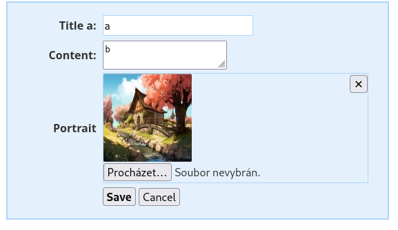

Nette form FileControl
======================

**FileControl** and **MultiFileControl** are Nette form inputs for file uploading that **behave exactly like other Nette inputs**: `setValue()` sets the value, `getValue()` returns it, and validation, conditional validation, and error messages work identically to text or select inputs.

The standard `<input type="file">` has several inconveniences when editing existing data:

1. The original file cannot be shown in any reasonable way — unlike other inputs, where the original value can be displayed.
2. Related to that is how to delete an existing file.
3. When an unrelated error occurs elsewhere in the form, the user has to upload the file again.
4. Uploading large files is a chapter of its own.

FileControl solves this:

1. An existing file is represented by a value of the `FileCurrent` class. If the user deletes it, the form knows about it.
2. Uploaded files are kept in a transaction — once uploaded, a file does not need to be uploaded again even if the form fails for another reason.

The input value can take one of three forms:

- `null` — no file, or the original file was deleted
- `FileUploaded` — a newly uploaded file (stored in the transaction, waiting to be committed to the system)
- `FileCurrent` — the original file stored in the system


## Version and requirements

| Branch | PHP | Nette |
|--------|-----|-------|
| `v2.0` | >= 8.1 | ^3.2 |
| `v1.2` | >= 7.4 | ^3.1 |


## Quick start

Register the extension in `config.neon`:

```neon
extensions:
    filecontrol: Taco\Nette\Forms\Controls\FileControlExtension

filecontrol:
    store: Taco\Nette\Forms\Controls\UploadStoreTemp('uploading/txt-', null, %tempDir%)
```

Use in a form:

```php
$form->addFileControl('portrait', 'Portrait');
$form->addMultiFileControl('attachments', 'Attachments');
```

A form with a single file (`FileControl`) — an uploaded file has a delete button:


A form with multiple files (`MultiFileControl`) — with image previews, deletion of individual items (✕) and the ↻ button for preloading:




Runnable examples are available in the [`examples/`](examples/) directory.


## Features

### No-JS mode

**The controls are fully functional without JavaScript.** The ↻ button lets the user upload files before submitting the form — the page does a full round-trip, but all form state is preserved. Validation, errors, and the transaction mechanism all work the same way.

### JS enhancements: AJAX upload and ↻ button helpers

The controls are fully functional without any JS (see above) — the ↻ button is visible and the user clicks it manually. On top of that baseline, `assets/filecontrol.ts` / `assets/filecontrol.js` offer optional JS enhancements that can be integrated into any frontend:

- `initMultiFileAjaxUpload(container)` — replaces the round-trip with an immediate AJAX upload for `MultiFileControl`. Activates based on the container's `data-upload-url` attribute — the library sets that itself whenever the control is rendered within a Presenter, so it's nothing you need to manage.
- `initFileAjaxUpload(container)` — the same for `FileControl`.
- `initMultiFileAutoPreload(container)` — for when no AJAX URL is available: hides the ↻ button and clicks it automatically once files are selected, so the round-trip happens on its own instead of requiring a manual click.
- `initFileHideOnNew(container)` — the equivalent for `FileControl`: hides the delete button and the original file's label once a new file is selected, so they don't get in the way.
- `initFileClearButton(fileInput)` — inserts a ✕ button after `<input type="file">` to clear the selected files.

AJAX upload features (`initMultiFileAjaxUpload` / `initFileAjaxUpload`):

- **Immediate upload on file selection** — no need to click ↻ or submit the form
- **Chunked transfer for large files** — files are automatically split so each POST stays within `upload_max_filesize`; the server reassembles them inside the transaction
- **Progress bar** — a `<progress>` element is shown during chunked transfers
- **Inline preview** — the server returns a thumbnail or filename label, inserted into the page without a full reload

```js
import {
    initMultiFileAjaxUpload, initMultiFileAutoPreload,
    initFileAjaxUpload, initFileHideOnNew, initFileClearButton,
} from './filecontrol.js';

// data-upload-url is set by the library itself whenever the control is rendered
// within a Presenter — here it's only used to decide whether to wire up AJAX
// or the JS helper for the manual ↻ button.
document.querySelectorAll('[data-taco-type="file multiple"]').forEach(el => {
    el.dataset.uploadUrl ? initMultiFileAjaxUpload(el) : initMultiFileAutoPreload(el);
});
document.querySelectorAll('.taco-filecontrol-single').forEach(el => {
    el.dataset.uploadUrl ? initFileAjaxUpload(el) : initFileHideOnNew(el);
});
document.querySelectorAll('.taco-filecontrol-single input[type="file"]')
    .forEach(initFileClearButton);
```

### Validation

Works exactly like other Nette inputs — fully compatible with `addConditionOn()`, `addRule()`, and error messages:

```php
$form->addFileControl('portrait', 'Portrait')
    ->setRequired('Please select a file.')
    ->addRule($form::MaxFileSize, 'File is too large (max %d B).', 512 * 1024)
    ->addRule($form::MimeType, 'Only images are allowed.', ['image/jpeg', 'image/png'])
    ->addRule($form::Image, 'File must be an image.');
```

| Rule | Description |
|---|---|
| `Form::Required` / `setRequired()` | A file must be selected or already exist as `FileCurrent`. |
| `Form::MaxFileSize` | Maximum file size in bytes. |
| `Form::MimeType` | Allowed MIME types, e.g. `'image/jpeg'` or an array of types. |
| `Form::Image` | Shorthand for supported image formats (`image/jpeg`, `image/png`, `image/gif`, `image/webp`). |

### Upload errors

- **A file exceeds `upload_max_filesize`** — PHP marks the file with `UPLOAD_ERR_INI_SIZE`; the control displays a message with the limit value.
- **The combined upload exceeds `post_max_size`** — PHP silently discards the entire POST body. The control detects this from `Content-Length` and adds a form-level error.

---

## API

### setPreviewer()

Sets a previewer for formatting file previews. `GenericFilePreviewer` displays image thumbnails.

### getRemoveButtonPrototype()

Allows customizing the delete button: label, classes, title.

### Transactions

An uploaded file is automatically moved to the storage (transaction). This means the file does not need to be uploaded again on a validation error. After successful processing, it is available via `getValue()` like any other value.

Once committed to the system, the transaction can be discarded explicitly:

```php
$form['portrait']->destroyStore();
```

Or it can be left to the GC, which deletes it automatically after `UploadStoreTemp::$gcAgeLimit` expires.


## Building assets (TypeScript)

```bash
npm run build:assets
```

Compiled output: `assets/filecontrol.js` (symlinked into `examples/document_root/js/`).


## E2E tests (Playwright)

```bash
npm install
npx playwright install chromium  # first time only

npm run test:e2e        # run the tests
npm run test:e2e:ui     # interactive UI
```

The URL of the tested application is configured in `.env` via `APP_URL`. Outputs are saved to `temp/`.
